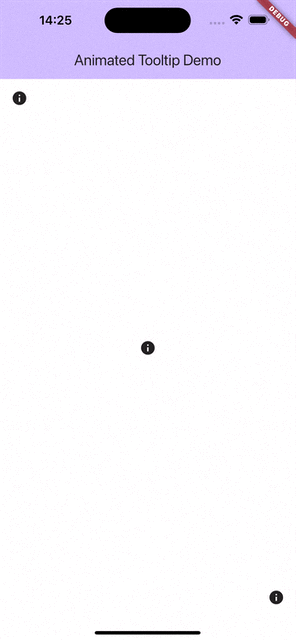

# Animated Flutter Tooltip
### Building Rich and Intuitive Tooltips in Flutter

## Flutter Tooltip
Flutter’s built-in tooltip, though functional, lacks visual appeal and customization options. Let’s create an animated and customisable tooltip to take the user experience to the next level!



## What We’re Building
We want a tooltip with an arrow that scales to the optimal content size, positions itself relative to the target using available space, and emerges from the center of the target.

You can find the complete example here. The animation is actually smooth when run on the simulator. Unfortunately, gif screen recording doesn’t capture smooth animations.


## How It Works
To display the tooltip above the rest of the UI we use an [Overlay](https://api.flutter.dev/flutter/widgets/Overlay-class.html). Flutter’s `OverlayPortal.targetsRootOverlay` creates an overlay portal that renders its widget on the root `Overlay` when shown.

Thanks to Flutter’s extensive widget library, most of the essential components are already there, minimising the need for custom work. There’s only four things we need to calculate ourselves:

* The vertical position of the tooltip relative to the target
* The horizontal alignment of the toolkit relative to the target
* The horizontal alignment of the arrow relative to the target
* The alignment (origin point) of the animation

For vertical positioning, we use the [Positioned](https://api.flutter.dev/flutter/widgets/Positioned-class.html) widget's `top` and `bottom` properties to position the tooltip above or below the target based on available space.

The tooltip’s horizontal alignment is based on the target's horizontal position relative to the screen width. The [Align](https://api.flutter.dev/flutter/widgets/Align-class.html) widget uses a relative system: -1 (far left), 0 (center), 1 (far right).

Here’s what the code looks like:

```dart
void _updatePosition() {
  final Size contextSize = MediaQuery.of(context).size;
  final BuildContext? targetContext = widget.targetGlobalKey != null
    ? widget.targetGlobalKey!.currentContext
    : context;
  final targetRenderBox = targetContext?.findRenderObject() as RenderBox;
  final targetOffset = targetRenderBox.localToGlobal(Offset.zero);
  final targetSize = targetRenderBox.size;
  // Try to position the tooltip above the target, 
  // otherwise try to position it below or in the center of the target.
  final tooltipFitsAboveTarget = targetOffset.dy - _tooltipMinimumHeight >= 0;
  final tooltipFitsBelowTarget = targetOffset.dy + targetSize.height + _tooltipMinimumHeight <= contextSize.height;
  _tooltipTop = tooltipFitsAboveTarget
      ? null
      : tooltipFitsBelowTarget
          ? targetOffset.dy + targetSize.height
          : null;
  _tooltipBottom = tooltipFitsAboveTarget
      ? contextSize.height - targetOffset.dy
      : tooltipFitsBelowTarget
          ? null
          : targetOffset.dy + targetSize.height / 2;
  // If the tooltip is below the target, invert the arrow.
  _isInverted = _tooltipTop != null;
  // Align the tooltip horizontally relative to the target.
  _tooltipAlignment = Alignment(
    (targetOffset.dx) / (contextSize.width - targetSize.width) * 2 - 1.0,
    _isInverted ? 1.0 : -1.0,
  );
  // Make the tooltip appear from the target.
  _transitionAlignment = Alignment(
    (targetOffset.dx + targetSize.width / 2) / contextSize.width * 2 - 1.0,
    _isInverted ? -1.0 : 1.0,
  );
  // Center the arrow horizontally on the target.
  _arrowAlignment = Alignment(
    (targetOffset.dx + targetSize.width / 2) / (contextSize.width - _arrowSize.width) * 2 - 1.0,
    _isInverted ? 1.0 : -1.0,
  );
}
```

## Tooltip Arrow
We use a [CustomPainter](https://api.flutter.dev/flutter/rendering/CustomPainter-class.html) to draw the arrow. One thing to keep in mind is that when the tooltip is positioned below the target (inverted), the arrow needs to be flipped upside down.

```dart
class TooltipArrowPainter extends CustomPainter {
  final Size size;
  final Color color;
  final bool isInverted;

  TooltipArrowPainter({
    required this.size,
    required this.color,
    required this.isInverted,
  });

  @override
  void paint(Canvas canvas, Size size) {
    final paint = Paint()
      ..color = color
      ..style = PaintingStyle.fill;

    final path = Path();

    if (isInverted) {
      path.moveTo(0.0, size.height);
      path.lineTo(size.width / 2, 0.0);
      path.lineTo(size.width, size.height);
    } else {
      path.moveTo(0.0, 0.0);
      path.lineTo(size.width / 2, size.height);
      path.lineTo(size.width, 0.0);
    }
    
    path.close();

    canvas.drawShadow(path, Colors.black, 4.0, false);
    
    canvas.drawPath(path, paint);
  }

  @override
  bool shouldRepaint(covariant CustomPainter oldDelegate) => false;
}

class TooltipArrow extends StatelessWidget {
  final Size size;
  final Color color;
  final bool isInverted;

  const TooltipArrow({
    super.key,
    this.size = const Size(16.0, 16.0),
    this.color = Colors.white,
    this.isInverted = false,
  });

  @override
  Widget build(BuildContext context) {
    return Transform.translate(
      offset: Offset(-size.width / 2, 0.0),
      child: CustomPaint(
        size: size,
        painter: TooltipArrowPainter(
          size: size,
          color: color,
          isInverted: isInverted,
        ),
      ),
    );
  }
}
```

## The Animation
We can encapsulate all the animation logic within a single function. The widget utilises a [CurvedAnimation](https://api.flutter.dev/flutter/animation/CurvedAnimation-class.html) that adjusts its direction (`forward` or `reverse`) based on whether the tooltip overlay is being shown or hidden.

```dart
final _overlayController = OverlayPortalController();
late final AnimationController _animationController = AnimationController(
  duration: const Duration(milliseconds: 200),
  vsync: this,
);
late final Animation<double> _scaleAnimation = CurvedAnimation(
  parent: _animationController,
  curve: Curves.easeOutBack,
);

void _toggle() {
  _delayTimer?.cancel();
  _animationController.stop();
  if (_overlayController.isShowing) {
    _animationController.reverse().then((_) {
      _overlayController.hide();
    });
  } else {
    _updatePosition();
    _overlayController.show();
    _animationController.forward();
  }
}
```

## Putting It All Together
Now let’s assemble our widget. Note that if no `theme` is provided, the widget will use a theme with inverted brightness to create contrast and make the tooltip stand out.

```dart
return OverlayPortal.targetsRootOverlay(
  controller: _overlayController,
  child: widget.child != null
      ? GestureDetector(onTap: _toggle, child: widget.child)
      : null,
  overlayChildBuilder: (context) {
    return Positioned(
      top: _tooltipTop,
      bottom: _tooltipBottom,
      // Provide a transition alignment to make the tooltip appear from the target.
      child: ScaleTransition(
        alignment: _transitionAlignment,
        scale: _scaleAnimation,
        // TapRegion allows the tooltip to be dismissed by tapping outside of it.
        child: TapRegion(
          onTapOutside: (PointerDownEvent event) {
            _toggle();
          },
          // If no theme is provided, a theme with inverted brightness is used.
          child: Theme(
            data: theme,
            // Don't allow the tooltip to get wider than the screen.
            child: SizedBox(
              width: MediaQuery.of(context).size.width,
              child: Column(
                mainAxisSize: MainAxisSize.min,
                children: [
                  if (_isInverted)
                    Align(
                      alignment: _arrowAlignment,
                      child: TooltipArrow(
                        size: _arrowSize,
                        isInverted: true,
                        color: theme.canvasColor,
                      ),
                    ),
                  Align(
                    alignment: _tooltipAlignment,
                    child: IntrinsicWidth(
                      child: Material(
                        elevation: 4.0,
                        color: theme.canvasColor,
                        borderRadius: BorderRadius.circular(8.0),
                        child: Padding(
                          padding: const EdgeInsets.all(16.0),
                          child: Column(
                            children: [
                              widget.content,
                              const SizedBox(height: 16.0),
                              Align(
                                alignment: Alignment.centerRight,
                                child: ElevatedButton(
                                  onPressed: _toggle,
                                  child: const Text('OK'),
                                ),
                              ),
                            ],
                          ),
                        ),
                      ),
                    ),
                  ),
                  if (!_isInverted)
                    Align(
                      alignment: _arrowAlignment,
                      child: TooltipArrow(
                        size: _arrowSize,
                        isInverted: false,
                        color: theme.canvasColor,
                      ),
                    ),
                ],
              ),
            ),
          ),
        ),
      ),
    );
  },
);
```

## Conclusion
While Flutter offers a vast collection of widgets, some provide less-than-ideal user experiences. However, by leveraging existing widgets to create new ones you can significantly enhance the usability of your app.